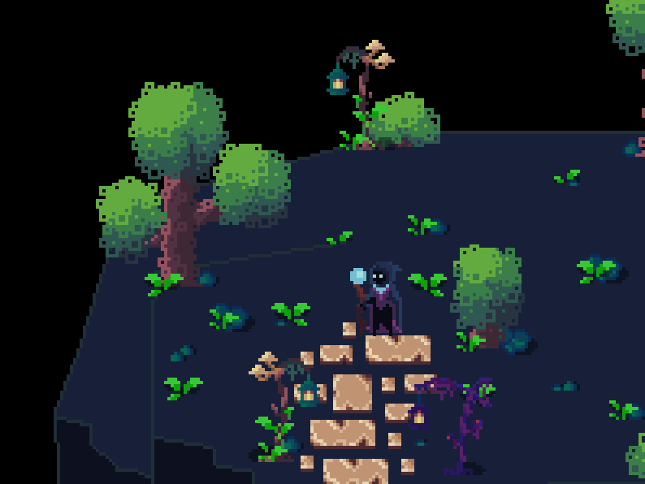
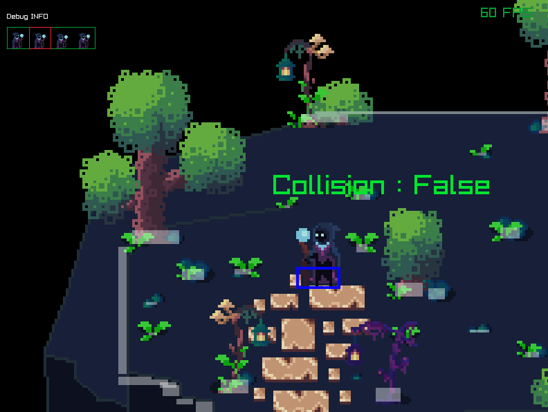

## Build

```bash
mkdir build
cd build
cmake ..
make
```

## Run

execute this command in project home dir

```bash
./build/WhereToGo
```

## Control

```
     ^
     w
 < r   s >        <d> toggle debug mode
     r            <n> attack
     v
```

 

 
